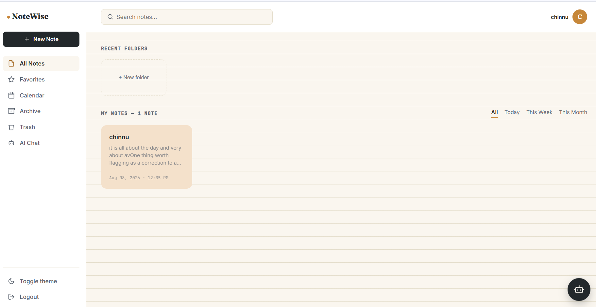
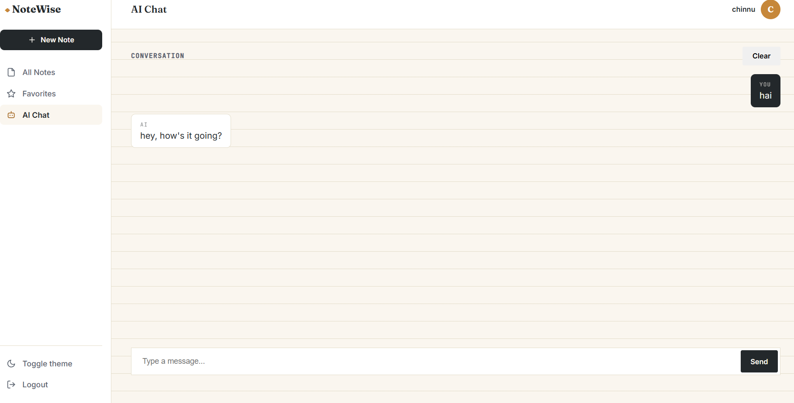
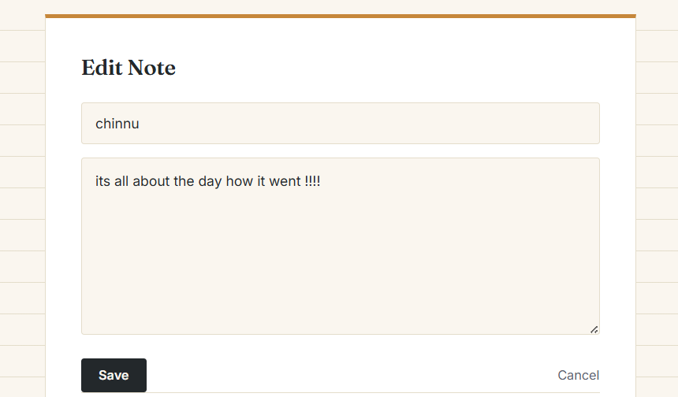

# NoteWise

A full-stack note-taking web application with user authentication, AI-powered summarization, and real-time search — built with Flask and SQLAlchemy.


**🔗 Live Demo:** [https://notewise-8lox.onrender.com](https://notewise-8lox.onrender.com)

Note: This app is hosted on Render's free tier. The first visit may take 30–60 seconds while the server wakes up.

## Features

- **User Authentication** — Secure signup/login with password hashing (Werkzeug)
- **CSRF Protection** — All forms protected with CSRF tokens using Flask-WTF
- **Notes CRUD** — Create, edit, and delete personal notes, scoped per user
- **Note Organization** — Archive notes, view in calendar, or move to trash
- **Search & Filter** — Real-time filtering by title, content, or favorites
- **AI Chat** — Conversational AI assistant powered by Groq's Llama 3.3 70B that helps with notes, code, and general questions
- **Favorites** — Mark important notes as favorites for quick access
- **Clean, custom UI** — Notebook/stationery-themed design, dark/light theme toggle
- **User Profiles** — Update your username and email anytime
- **Landing Page** — Animated introduction before signup

## Tech Stack

| Layer | Technology |
|---|---|
| Backend | Python, Flask |
| Database | SQLite, Flask-SQLAlchemy |
| Auth | Flask-Login, Werkzeug (password hashing) |
| AI | Groq API (Llama 3.3 70B) |
| Frontend | HTML, CSS (custom, no framework) |

## Screenshots

### Login - Secure authentication


### Dashboard - View and manage all your notes


### AI Chat - Natural conversation with your AI assistant


### Note Editor - Simple and clean note editing


### Archive & Calendar - Organize your notes


## Getting Started

### Prerequisites
- Python 3.10+
- A free [Groq API key](https://console.groq.com) (no credit card required)

### Installation

1. Clone the repository
```bash
git clone https://github.com/tanguturi-b/notewise.git
cd notewise
```

2. Create and activate a virtual environment
```bash
python -m venv venv
# Windows
.\venv\Scripts\Activate.ps1
# macOS/Linux
source venv/bin/activate
```

3. Install dependencies
```bash
pip install -r requirements.txt
```

4. Create a `.env` file in the project root:

5. Run the app
```bash
python app.py
```

6. Open `http://127.0.0.1:5000` in your browser

## Project Structure

## Database Schema

**User** — id, username, email, password_hash, created_at, updated_at

**Note** — id, title, content, created_at, updated_at, user_id (FK → User), is_favorite, is_archived, is_deleted

**ChatHistory** — id, user_id (FK → User), role, content, created_at

## What I Learned Building This

- Smplementing CSRF protection for all forms using Flask-WTF
- Integrating a third-party LLM API into a live application with natural conversational UI
- Building an interactive AI chat that understands context and user needs
- Writing scoped database queries to ensure users can only access their own data
- Designing a conversational AI that feels helpful and natural, not robotic
- Iterative UI design — moving from a generic template look to a deliberate, custom theme
- Implementing soft deletes (archiving/trash) for better data managementfailures
- Writing scoped database queries to ensure users can only access their own data
- Iterative UI design — moving from a generic template look to a deliberate, custom theme

- [x] User authentication & authorization
- [x] CRUD operations for notes
- [x] AI-powered chat assistant
- [x] CSRF protection for all forms
- [x] Archive and trash system
- [x] Calendar view for notes
- [x] Dark/light theme toggle
- [ ] Collaborative note sharing
- [ ] Real-time sync across devices
- [ ] Export notes (PDF, Markdown)
- [ ] Note tags and categorie


## Roadmap
- [ ] Always gets new versions


## License

MIT