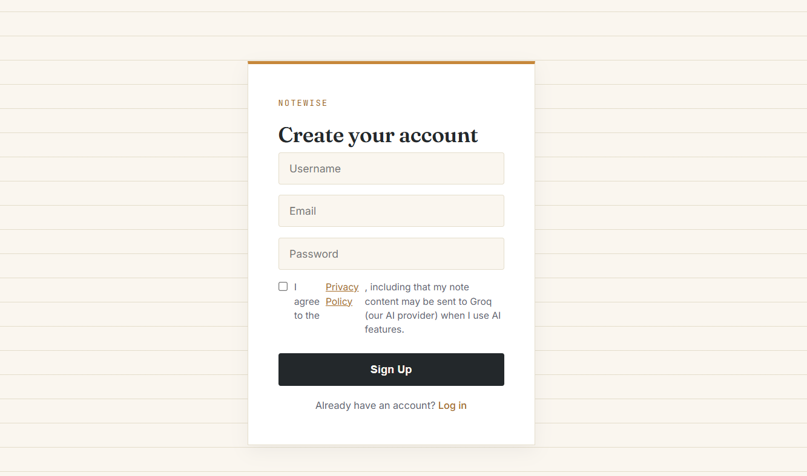
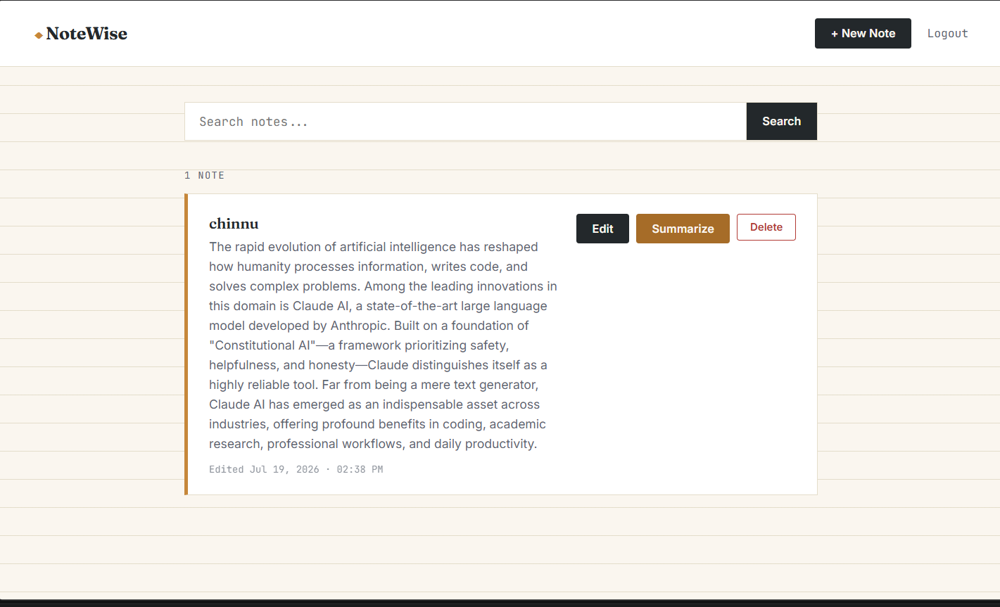

# NoteWise

A full-stack note-taking web application with user authentication, AI-powered summarization, and real-time search — built with Flask and SQLAlchemy.


## Features

- **User Authentication** — Secure signup/login with password hashing (Werkzeug)
- **Notes CRUD** — Create, edit, and delete personal notes, scoped per user
- **Search** — Real-time filtering of notes by title or content
- **AI Summarization** — One-click note summarization powered by Groq's LLM API (Llama 3.3 70B)
- **Clean, custom UI** — Notebook/stationery-themed design, no UI framework

## Tech Stack

| Layer | Technology |
|---|---|
| Backend | Python, Flask |
| Database | SQLite, Flask-SQLAlchemy |
| Auth | Flask-Login, Werkzeug (password hashing) |
| AI | Groq API (Llama 3.3 70B) |
| Frontend | HTML, CSS (custom, no framework) |

## Screenshots

### Login


### AI Summarization in action


## Getting Started

### Prerequisites
- Python 3.10+
- A free [Groq API key](https://console.groq.com) (no credit card required)

### Installation

1. Clone the repository
```bash
git clone https://github.com/tanguturi-b/notewise.git
cd notewise
```

2. Create and activate a virtual environment
```bash
python -m venv venv
# Windows
.\venv\Scripts\Activate.ps1
# macOS/Linux
source venv/bin/activate
```

3. Install dependencies
```bash
pip install -r requirements.txt
```

4. Create a `.env` file in the project root:

5. Run the app
```bash
python app.py
```

6. Open `http://127.0.0.1:5000` in your browser

## Project Structure

## Database Schema

**User** — id, username, email, password_hash, created_at

**Note** — id, title, content, created_at, updated_at, user_id (FK → User)

## What I Learned Building This

- Structuring a Flask app with separation of routes, models, and config
- Implementing secure authentication with password hashing and session management (Flask-Login)
- Integrating a third-party LLM API into a live application, with error handling for API failures
- Writing scoped database queries to ensure users can only access their own data
- Iterative UI design — moving from a generic template look to a deliberate, custom theme

## Roadmap

- [ ] Dark mode
- [ ] PDF export
- [ ] Live deployment
- [ ] Distinct success/error flash message styling

## License

MIT